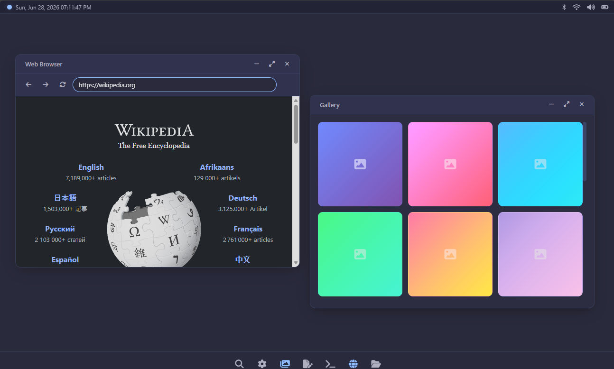

OS Desktop Website
- A web-based operating system simulation website featuring a desktop environment with draggable windows, a taskbar, and multiple built-in applications.

Features
- Taskbar with animated hover effects on icons
- Draggable windows with minimize, maximize, and close controls
- Settings panel to customize background and accent colors
- Image gallery with scrollable placeholder cards
- Search overlay for quick content filtering
- Built-in applications:
- Web Browser (iframe-based)
- Terminal (with command support: help, clear, date, whoami, uname, ls, pwd, echo, neofetch, color)
- Text Editor
- File Manager
- Top status bar with live clock and system icons (Bluetooth, WiFi, Sound)
- Charcoal dark theme with pastel blue accent (customizable)
- Getting Started
- Clone or download this repository
- Open os.html in a web browser
- No server required — works as a static file
- File Structure
- os.html — Main HTML structure style.css — Tailwind CSS + custom styles script.js — All interactivity and logic

Customization
- Open the Settings app from the taskbar to change:
- Background color (charcoal, pastel green, pastel orange, pastel sky-blue, pastel purple)
- Accent color (pastel blue, pastel green, pastel orange, pastel purple, pastel pink, pastel sky-blue)
- Or use the custom color picker for any color

Browser Notes
The built-in browser uses an iframe. Some websites block iframe embedding via X-Frame-Options or CSP headers and will show an error with a link to open in a new tab. Sites that allow embedding (Wikipedia, documentation sites, etc.) will work normally.

## 🧠 Development Note

This project was developed using **vibe coding**—an iterative, high-level conceptual development approach where the developer guides the "vibe" and intent while the AI handles the heavy lifting of implementation.
> **Built with the help of:** qwen3.6-35b-a3b model.

## 📄 License

Distributed under the MIT License. Read [LICENSE](LICENSE) here 
